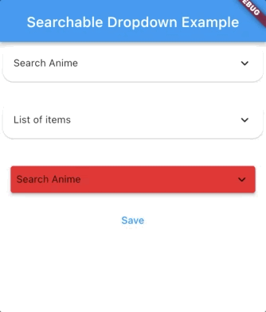

<!-- 
This README describes the package. If you publish this package to pub.dev,
this README's contents appear on the landing page for your package.

For information about how to write a good package README, see the guide for
[writing package pages](https://dart.dev/guides/libraries/writing-package-pages). 

For general information about developing packages, see the Dart guide for
[creating packages](https://dart.dev/guides/libraries/create-library-packages)
and the Flutter guide for
[developing packages and plugins](https://flutter.dev/developing-packages). 
-->

This Flutter package helps create a dropdown which constains a search bar inside.
And also provides a feature for compatibility with paginated searchable requests.

## Features

SearchableDropdown for pre setted item list,
SearchableDropdown.paginated for normal or paginated requests.
SearchableDropdownFormfield for compatibility with forms.



## Getting started

To use this package, add searchable_dropdown as a dependency in your [pubspec.yaml] file. And add this import to your file.

```dart
import 'package:searchable_dropdown/searchable_dropdown.dart';
```

## Usage

Pre setted item list example

```dart
SearchableDropdown<int>(
    hintText: const Text('List of items'),
    margin: const EdgeInsets.all(15),
    items: List.generate(10, (i) => SearchableDropdownMenuItem(value: i, label: 'item $i', child: Text('item $i'))),
    onChanged: (int? value) {
        debugPrint('$value');
    },
)
```

Paginated request example, you can also give a request that fetches all items.
requestItemCount: Paginated request item count which returns in one page, this value is using for knowledge about isDropdown has more item or not.

```dart
SearchableDropdown<int>.paginated(
    hintText: const Text('Search Anime'),
    margin: const EdgeInsets.all(15),
    getRequest: (int page, String? searchKey) async {
        final paginatedList = await getAnimeList(page: page, key: searchKey);
        return paginatedList?.animeList
            ?.map((e) => SearchableDropdownMenuItem(value: e.malId, label: e.title ?? '', child: Text(e.title ?? '')))
            .toList();
    },
    requestItemCount: 10,
    onChanged: (int? value) {
        debugPrint('$value');
    },
)
```

Example of usage inside a form.
backgroundDecoration: Background decoration of dropdown, i.e. with this you can wrap dropdown with Card

```dart
Form(
    key: formKey,
    child: SearchableDropdownFormField<int>(
        backgroundDecoration: (child) => Card(
            margin: EdgeInsets.zero,
            color: Colors.red,
            elevation: 3,
            child: Padding(
            padding: const EdgeInsets.all(8.0),
            child: child,
            ),
        ),
        hintText: const Text('Search Anime'),
        margin: const EdgeInsets.all(15),
        items: List.generate(10, (i) => SearchableDropdownMenuItem(value: i, label: 'item $i', child: Text('item $i'))),
        validator: (val) {
            if (val == null) return 'Cant be empty';
            return null;
        },
        onSaved: (val) {
            debugPrint('On save: $val');
        },
    ),
)
```

## License

[](/LICENSE)
